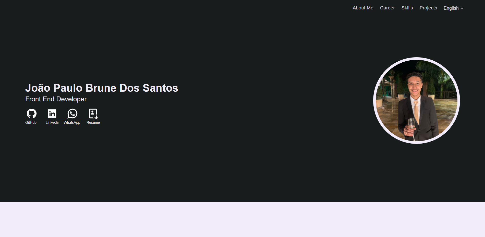

<h1 align="center">
    :rocket: Portfolio
</h1>

<p align="center">
  Eu construí esse portfolio com objetivo de apresentar minhas habilidades, carreira, lista de contatos...
	Além do Português também adotei o Inglês como alternativa do idioma.
</p>

## :computer: Aplicação

<p align="center">
    
</p>

## :wrench: Pré-requisitos

 Antes de começar, você vai precisar ter instalado em sua máquina as seguintes ferramentas:
[Git](https://git-scm.com) e o [Node.js](https://nodejs.org/en/).
Além disto é bom ter um editor para trabalhar com o código como o [VSCode](https://code.visualstudio.com/)

## :rocket: Para rodar a aplicação

```bash

# Clone este repositório
$ git clone https://github.com/Joaobru/Portfolio.git

# Acesse a pasta do projeto no seu terminal/cmd
$ cd Portfolio

# Execute o comando para instalar todas as dependências
$ npm install ou yarn

# Execute a aplicação em modo de desenvolvimento
$ npm start ou yarn start

# A aplicação será aberta na porta:3000 - acesse http://localhost:3000

```

## 🛠 Tecnologias

  * [ReactJS](https://reactjs.org/) + [TypeScript](https://www.typescriptlang.org/) (Front-End);

  * [i18n](https://www.i18next.com/) (Internacionalização);

	* [Styled Components](https://styled-components.com/) (Estilização);


